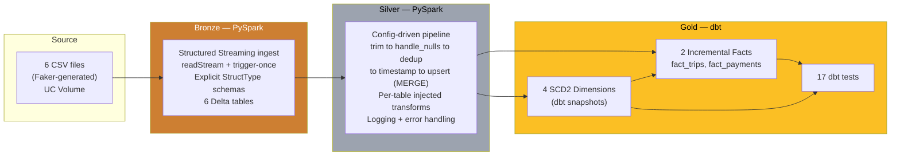
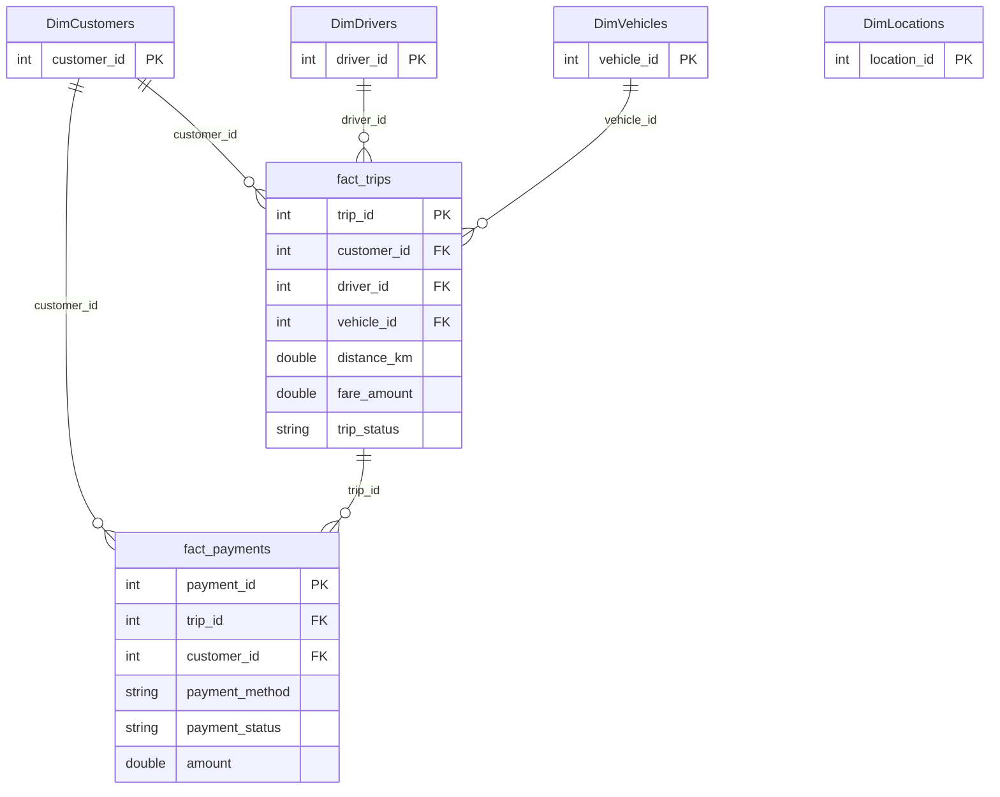

# Rideshare Data Lakehouse — Medallion Architecture with PySpark & dbt

An end-to-end data engineering pipeline built on **Databricks**, taking raw rideshare data from CSV files all the way to a tested, analytics-ready **star (galaxy) schema**. The project follows the **Medallion Architecture** (Bronze → Silver → Gold), using **PySpark** for ingestion and cleaning and **dbt** for dimensional modeling and data quality testing.

> **Pipeline scope:** ingestion → cleaning & standardization → dimensional modeling → data quality tests.

---

## Tech Stack

| Layer | Technology |
|-------|-----------|
| Platform | Azure Databricks (Unity Catalog) |
| Storage | Delta Lake |
| Ingestion & Transformation | PySpark (Structured Streaming) |
| Modeling & Testing | dbt (dbt Cloud) |
| Version Control / CI | GitHub |
| Language | Python, SQL |

---

## Dataset

Synthetic rideshare data generated with **Faker** — six source tables:

| Table | Role | Rows | Grain |
|-------|------|------|-------|
| `customers` | Dimension | 200 | one row per customer |
| `drivers` | Dimension | 50 | one row per driver |
| `vehicles` | Dimension | 50 | one row per vehicle |
| `locations` | Dimension | 50 | one row per location |
| `trips` | **Fact** | 1000 | one row per trip (event) |
| `payments` | **Fact** | 1000 | one row per payment (event) |

The row-count contrast is the classic fact-vs-dimension tell: facts are events (many rows), dimensions are entities (few rows).

---

## Architecture


## Data Quality

Two-layer data quality, enforced at the right stage:

**Silver — gatekeeper (quarantine).** Every row is validated against business rules before entering the silver tables. Rows that fail are diverted to a `{table}_quarantine` table with a `quarantine_reason` and `quarantined_at` timestamp — bad data never reaches gold, but is never lost (preserved for investigation). Checks include:
- `fare_amount > 0`, `distance_km > 0` (trips)
- `driver_rating` between 0 and 5 (drivers)
- `signup_date` not in the future (customers)
- `latitude` / `longitude` within valid geographic ranges (locations)
- `year` and `vehicle_type` within valid sets (vehicles)
- valid `payment_method`, `payment_status`, `trip_status` values

**Gold — contract (dbt tests).** dbt `accepted_values` tests assert the valid-set contracts hold, failing the build if any invalid category appears. Range checks (e.g. amounts > 0) are enforced upstream in silver, so they are not duplicated here — each check lives at the layer where it belongs.

Verified by injecting a known-bad row (negative fare) and confirming it was quarantined, not written to the clean table.
### The Medallion Layers

**Bronze (PySpark)** — Raw ingestion. Reads the six CSVs via Structured Streaming (`readStream` + trigger-once) and lands them as Delta tables. Uses **explicit `StructType` schemas** instead of `inferSchema` — this is faster (no sampling pass), correct (e.g. `phone_number` is typed as `string` so leading zeros are never stripped), and stable (the schema is a fixed contract, not a per-run guess).

**Silver (PySpark)** — Clean and standardize. A single **config-driven** function processes every table through a shared backbone (`trim → handle_nulls → dedup → timestamp → upsert`), with each table's unique steps injected as a per-table function. Idempotent by design (upsert/MERGE, not append). Every operation is logged, and errors are caught, logged with context, and re-raised.

**Gold (dbt)** — Model for analytics. Four **SCD2 dimensions** (via dbt snapshots) and two **incremental fact** models, forming a two-fact galaxy schema, validated by 17 dbt tests.

---

## Data Model — Galaxy (Constellation) Schema

Two fact tables sharing conformed dimensions:



---

## Key Design Decisions

**Payments is a fact, not a dimension.** Payments is an event with a timestamp and a summable measure (`amount`), ~1000 rows vs ~50 for dimensions. It is modeled as an append-only fact, not snapshotted.

**Facts are append-only; dimensions are SCD2.** Facts are immutable events (a trip happened — it can't change), so new events are appended via incremental models. Dimensions change over time (a customer moves city, a driver's rating changes), so they are tracked with SCD Type 2.

**SCD2 is handled in Gold via dbt snapshots — not hand-written in PySpark.** History tracking is a modeling concern, and dbt snapshots manage `valid_from` / `valid_to` / surrogate keys automatically and tested. (An earlier hand-written PySpark SCD2 had a null-key bug — a good reminder not to reinvent what a tool does reliably.)

**Dropped `start_location` / `end_location` from trips — a real data-quality finding.** The synthetic source had a referential-integrity gap: 50 location cities vs ~1,854 distinct trip location names, with only ~5 overlapping. Rather than fabricate a join that would null ~99.7% of rows, the columns were dropped and flagged as a data-quality issue, while the `locations` dimension was retained to demonstrate the SCD2 technique.

**`trip_status` kept as a degenerate dimension.** Cancelled / Ongoing / Completed lives in no dimension table, so it stays on `fact_trips` — dropping it would lose cancellation- and completion-rate analytics.

**Config-driven Silver.** The Silver layer processes all six tables through one generic function driven by a config, with per-table logic injected as functions. Adding a table is one config line, not a copy-paste — open for extension, closed for modification.

**Explicit schemas over inference.** Bronze declares every column type explicitly. Beyond performance, this prevents silent corruption — e.g. `phone_number` stays a `string`, so identifiers with leading zeros are preserved.

---

## Data Quality — 17 dbt Tests

All tests pass (0 errors). Coverage includes:

- **Uniqueness & not-null** on fact primary keys (`trip_id`, `payment_id`).
- **Referential integrity** — `relationships` tests proving fact → dimension foreign keys hold (including a fact → fact link: `fact_payments.trip_id → fact_trips`).
- **Dimension keys** — business keys `not_null`; SCD2 surrogate keys (`dbt_scd_id`) `unique`.

---

## Repository Structure

```
pysparkdbt-lakehouse/
├── notebooks/                  # PySpark (Bronze + Silver)
│   ├── bronze_ingestion.ipynb
│   ├── silver_transformation.ipynb
│   └── utils/
│       └── custom_utils.py     # Reusable transformation library
├── models/
│   └── gold/                   # dbt fact models + tests
├── snapshots/                  # dbt SCD2 dimension snapshots
├── macros/                     # dbt macros (e.g. generate_schema_name)
└── dbt_project.yml
```

---

## How It Runs

1. **Bronze** — run `bronze_ingestion` to stream the six CSVs into Delta bronze tables using explicit schemas.
2. **Silver** — run `silver_transformation` to clean, dedup, and upsert into silver tables via the config-driven pipeline.
3. **Gold** — `dbt snapshot` builds the SCD2 dimensions, then `dbt build` builds the fact models and runs all 17 tests.

---

## Author

**Pragadesh K**
GitHub: [@pragathimails-cyber](https://github.com/pragathimails-cyber) · LinkedIn: [Pragadeeshwaran Kannadasan](https://www.linkedin.com/in/pragadeeshwaran-kannadasan)
